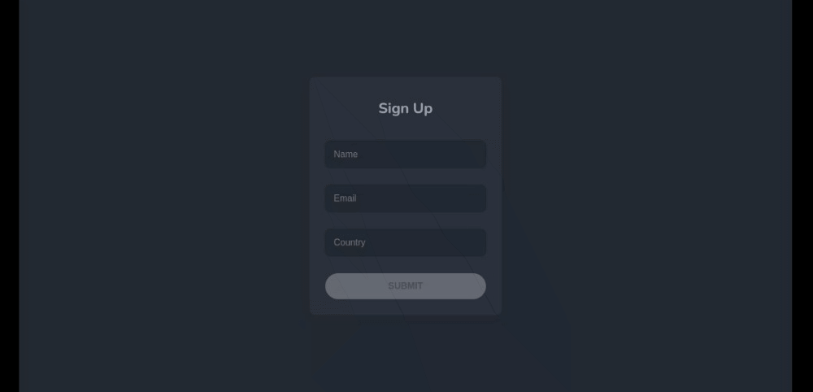
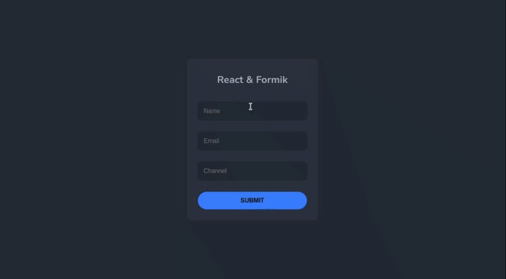

# LarnU Fullstack Bootcamp

## INTRO TO TESTING WITH REACT FORMIK

REACT FORM USING FORMIK LIBRARY
React Form using Formik, Form, Field, ErrorMessage Components.
Form validationSchema using Yup Library.

This project uses, Javascript and vanilla CSS, vite, vitest and
react testing library for testing.

 

- npm install
- npm run dev
- npm run test

  To run single unit tests run:

- npx vitest {componentFileName} --run

 

